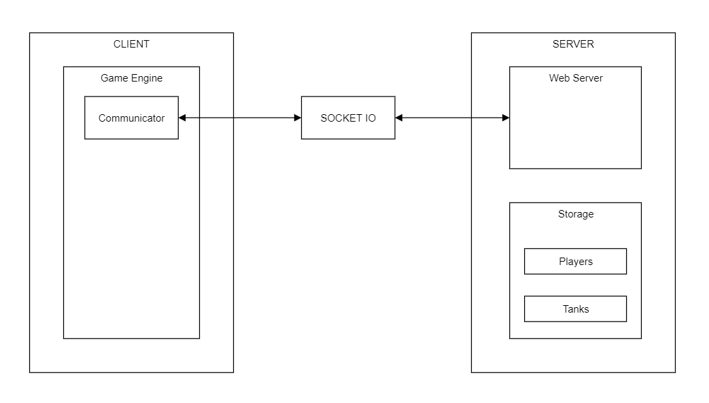
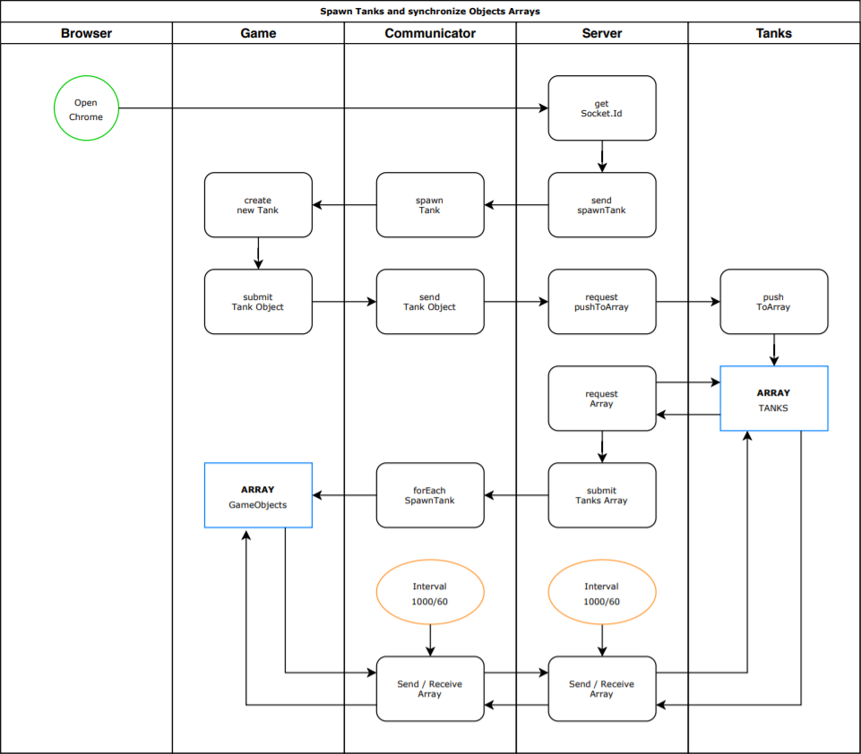

# Space-Invaders-Multiplayer
Based on the first Space Invaders single player
https://github.com/Sjaaak777/My1stSpaceGame.git

Build a new code structure where the client code is separated from the game engine.
The idea for this is to be more flexible to create an own engine library for future games.
- Client
- Engine
- Server

> Layout of the setup.

> Communication flow.

